# Philippe Majerus’s cowsay files collection


## Introduction

This repository contains the characters files ("cows") I created for the [cowsay/cowthink utility](https://en.wikipedia.org/wiki/Cowsay).
While original cowsay files are ASCII-art, I decided to experiment with ANSI/VT coloring, extended Unicode characters, pseudo-pixels (such as Unicode 13.0 sextants and Unicode 16.0 octants), and [Sixels](https://en.wikipedia.org/wiki/Sixel).


## Characters in this repository


### alexkidd
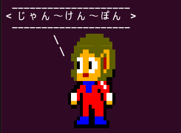

This uses Unicode 13.0 sextants and ANSI/VT colors (256 colors).
It is based on the Mark III / Master System game Alex Kidd in Miracle World / アレックスキッドのミラクルワールド.


### alis
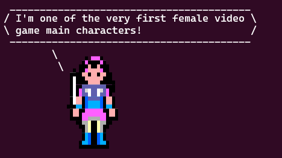

This uses Unicode 13.0 sextants and ANSI/VT colors (256 colors).
It is based on Alis Landale (アリサ・ランディール), the main character from the Mark III / Master System game Phantasy Star / ファンタシースター.


### bobblun
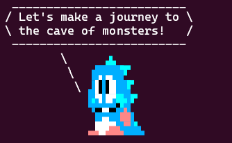

This uses Unicode 13.0 sextants and ANSI/VT colors (256 colors).
It is based on Bobblun (Bob) / ボブルン, one of the two main characters from the arcade game Bubble Bobble / バブルボブル.


### bock
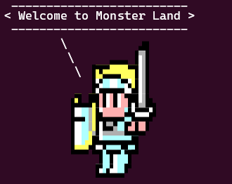

This uses Unicode 13.0 sextants and ANSI/VT colors (256 colors).
It is based on Bock, the main character from the game Wonder Boy in Monster Land / ワンダーボーイⅡ モンスターワールドⅠ, from its Mark III / Master System port.


### bubblun
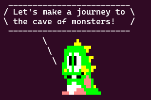

This uses Unicode 13.0 sextants and ANSI/VT colors (256 colors).
It is based on Bubblun (Bub) / バブルン, one of the two main characters from the arcade game Bubble Bobble / バブルボブル.


### clippit
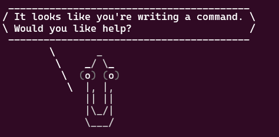

This uses MS-DOS codepage 437 characters and ANSI/VT colors (16 colors) and attributes.
It is based on the assistant from Microsoft Office.


### sxl-cow
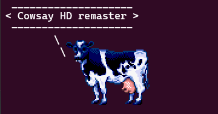

This uses a sixel image.
It is based on the cow sprite from the Super Famicom / SNES game Earthworm Jim.

The idea of this character is to provide a "HD remaster" of the original cow.
It can be used as a replacement for the ANSI-art cow used when `cowsay` is called without a `-f` option. To achieve this, rename the `default.cow` that ships with cowsay to `legacy-cow.cow`, and create a symbolic link `default.cow` pointing to `sxl-cow.cow` as follows:
```bash
cd /usr/share/cowsay/cows
sudo mv default.cow legacy-cow.cow
sudo ln -s sxl-cow.cow default.cow
```


### donkeykong
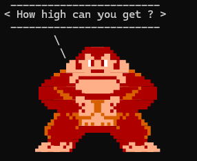

This uses Unicode 16.0 octants and ANSI/VT colors (256 colors).
It is based on the original arcade game Donkey Kong.


### dukenukem
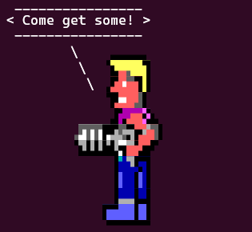

This uses Unicode 13.0 sextants and ANSI/VT colors (256 colors).
It is based on the original PC game Duke Nukem by Apogee Software.


### flappybird
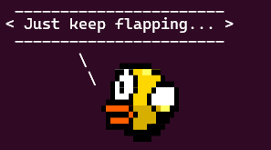

This uses Unicode 13.0 sextants and ANSI/VT colors (256 colors).
It is based on the mobile phone game Flappy Bird.


### sxl-guybrush
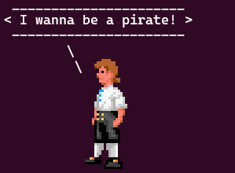

This is a sixel image conversion of Guybrush Threepwood from The Secret of Monkey Island.


### hal9000
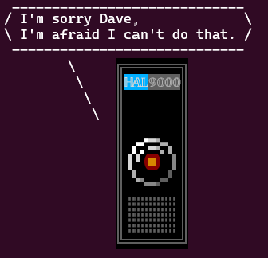

This uses Unicode 16.0 octants and separated sextants, and ANSI/VT colors (256 colors).
It is based on the artificial intelligence character HAL 9000 from the movie 2001: A Space Odyssey.


### hellokitty
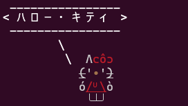

This uses extended Unicode characters and ANSI/VT colors (16 colors) and attributes (strikethrough, underline).
It is based on the Hello Kitty / ハロー・キティ character by Yuko Shimizu / Sanrio.


### sxl-indy
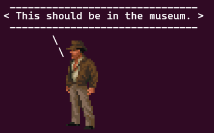

This is a sixel image conversion of Indiana Jones (Indy) from Indiana Jones and the Fate of Atlantis.


### kirby
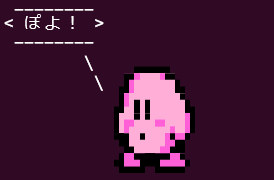

This uses Unicode 13.0 sextants and ANSI/VT colors (256 colors).
It is based on the Famicom / NES game Kirby's Adventure / 星のカービィ 夢の泉の物語 (original Japanese color).


### link
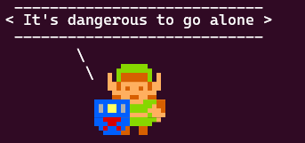

This uses Unicode 16.0 octants and ANSI/VT colors (256 colors).
It is based on the Famicom / NES game The legend of Zelda / ゼルダの伝説 (The Hyrule Fantasy).


### link-16bit
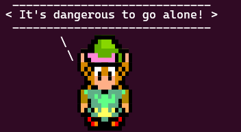

This uses Unicode 13.0 sextants and ANSI/VT colors (256 colors).
It is based on the Super Famicom / SNES game The legend of Zelda / ゼルダの伝説 - A Link to the Past / 神々のトライフォース.


### mario
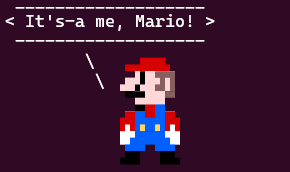

This uses Unicode 13.0 sextants and ANSI/VT colors (256 colors).
It is based on the Famicom / NES game Super Mario Bros, but with modern colors.


### sxl-mario+yoshi
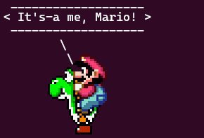

This is a sixel image conversion of the Super Mario World sprites of Mario and Yoshi.


### mickey
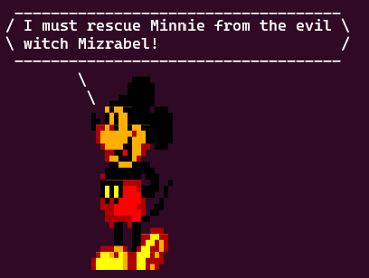

This uses Unicode 13.0 sextants and ANSI/VT colors (256 colors).
It is based on the Mark III / Master System game Castle of Illusion starring Mickey Mouse / アイラブミッキーマウス ふしぎのお城大冒険 (8-bit).


### mona
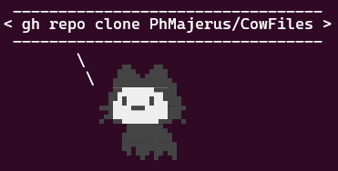

This uses Unicode 16.0 octants and ANSI/VT colors (256 colors).
It is based on the GitHub octocat mascot loading animation.


### sxl-pikachu
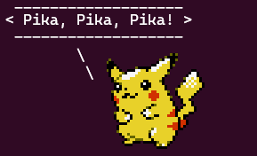

This is a sixel image conversion of the Pikachu sprite of Pokémon Gold & Silver / ポケットモンスター 金 & 銀.


### sxl-popeye
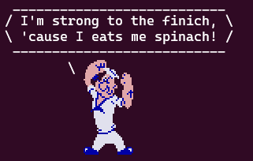

This is a sixel image conversion of the Popeye the Sailor sprite from the Popeye arcade game.


### psychofox
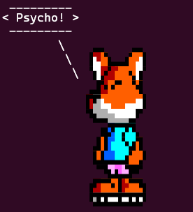

This uses Unicode 13.0 sextants and ANSI/VT colors (256 colors).
It is based on Psycho Fox, the main character from the eponymous Mark III / Master System game.


### ralph-face
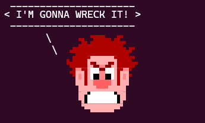

This uses Unicode 16.0 octants and ANSI/VT colors (256 colors).
It is based on the cover of the movie soundtrack of Wreck-It Ralph.


### rhindle
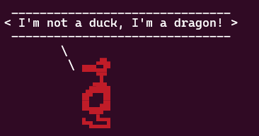

This uses Unicode 16.0 octants and ANSI/VT colors (16 colors).
It is  based on Rhindle (red dragon) sprite from the Adventure Atari 2600 game.


### rockman
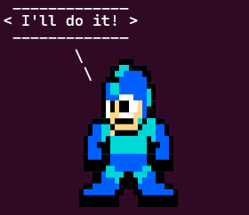

This uses Unicode 13.0 sextants and ANSI/VT colors (256 colors).
It is based on the Famicom / NES game Rockman / ロックマン / Mega Man.


### rover
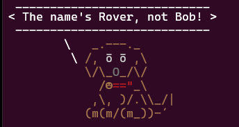

This uses MS-DOS codepage 437 characters and ANSI/VT colors (16 colors) and attributes.
It is based on the assistant from Microsoft Bob and Windows XP.


### sxl-ryu
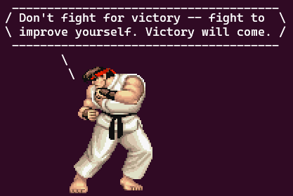

This is a sixel image conversion of a Ryu sprite from the game Street Fighter II.


### sxl-scrooge-face
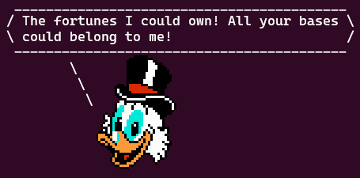

This is a sixel image conversion of Scrooge McDuck's face from the DuckTales Famicom / NES game title screen.


### sxl-shadowdancer
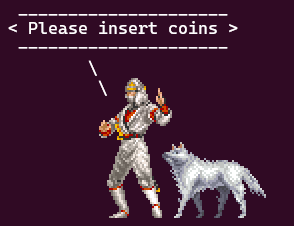

This is a sixel image conversion of the main character and his dog sprites from Shadow Dancer / 影の舞.


### shinobi
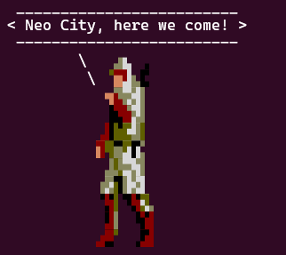

This uses Unicode 13.0 sextants and ANSI/VT colors (256 colors).
It is based on the sprite of Joe Musashi in the Game Gear game The GG 忍 Shinobi.


### shinobi-original
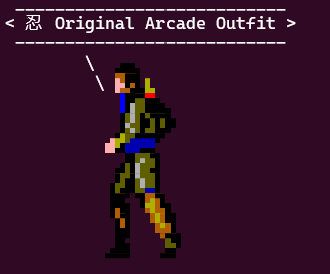

This uses Unicode 16.0 octants and ANSI/VT colors (256 colors).
It is based on the sprite of Joe Musashi in the Mark III / Master System version of the game 忍 Shinobi.


### shion
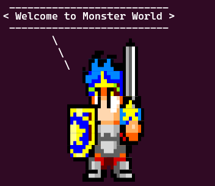

This uses Unicode 13.0 sextants and ANSI/VT colors (256 colors).
It is based on the sprite of Shion in the Mega Drive game Wonder Boy in Monster World / ワンダーボーイⅤ モンスターワールドⅢ.


### sonic
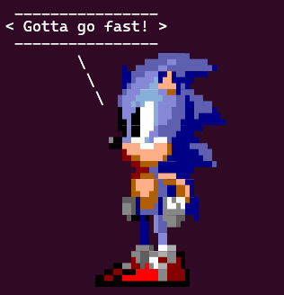

This uses Unicode 16.0 octants and ANSI/VT colors (256 colors).
It is based on the Game Gear version of the game Sonic the Hedgehog 2.


### sxl-strider
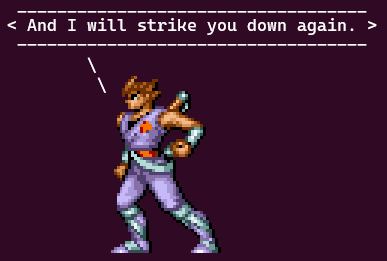

This is a sixel image conversion of Strider Hiryu / ストライダー飛竜 sprite from the eponymous game.


### tamagotchi
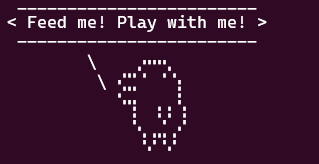

This uses Unicode 16.0 separated sextants.
It is based on the 1<sup>st</sup> generation of Tamagotchi / たまごっち LCD toy by Bandai.


### sxl-tentacle
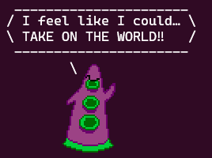

This is a sixel image conversion of the Purple Tentacle sprite from Day of the Tentacle.


### tiki
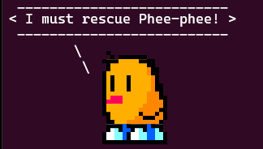

This uses Unicode 16.0 octants and ANSI/VT colors (256 colors).
It is based on the arcade game The NewZealand Story.


### tomtom
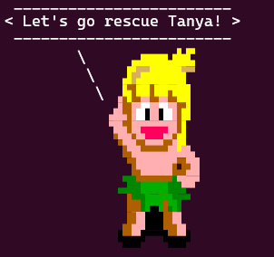

This uses Unicode 13.0 sextants and ANSI/VT colors (256 colors).
It is based on the sprite of Tom-Tom in the arcade game Wonder Boy / ワンダーボーイ.


### sxl-vanellope
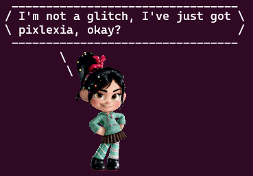

This is a sixel image conversion of Vanellope von Schweetz character illustration from Wreck-It Ralph.


## Installing & using cow files
You'll need the cowsay utility, so start with `sudo apt install cowsay` or equivalent for your distro.

Copy the files from this repo's `cows` folder to  `/usr/share/cowsay/cows`.

Then simply use the `cowsay -f [character name] [message]` command.

For Unicode sextants and octants, you will need recent fonts that include the _Legacy Computing Symbols_, such as [Cascadia Mono](https://github.com/microsoft/cascadia-code), [Cozette](https://github.com/the-moonwitch/Cozette), or [Iosevka Term](https://github.com/be5invis/Iosevka).
For sixels images support, [Windows Terminal](https://github.com/microsoft/terminal) or another VT340-compatible terminal emulator is required.

---

-- Philippe Majerus, September 2024 to May 2026

_These are all designed to celebrate classic pixel art nostalgia. All characters and trademarks are the property of their respective owners._

---

If you enjoy ANSI-art and Unicode semigraphics, also check out [my FIGfonts collection](https://github.com/PhMajerus/FIGfonts) and [my ANSI-art collection](https://github.com/PhMajerus/ANSI-art).
