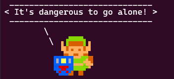
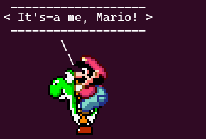

# Philippe Majerus's cowsay files collection


## Introduction

This repository contains the characters files ("cows") I created for the [cowsay/cowthink utility](https://en.wikipedia.org/wiki/Cowsay).
While original cowsay files are ASCII-art, I decided to experiment with ANSI/VT coloring, extended Unicode characters, pseudo-pixels (such as Unicode 13.0 sextants and Unicode 16.0 octants), and [Sixels](https://en.wikipedia.org/wiki/Sixel).


## Characters in this repository


### alexkidd


This uses Unicode 13.0 sextants and ANSI/VT colors (256 colors).
It is based on the Mark III/Master System game Alex Kidd in Miracle World.


### clippit


This uses MS-DOS codepage 437 characters and ANSI/VT colors (16 colors) and attributes.
It is based on the assistant from Microsoft Office.


### flappybird


This uses Unicode 13.0 sextants and ANSI/VT colors (256 colors).
It is based on the mobile phone game Flappy Bird.


### hellokitty


This uses extended Unicode characters and ANSI/VT colors (16 colors) and attributes (strikethrough, underline).
It is based on the Hello Kitty character by Yuko Shimizu / Sanrio.


### link


This uses Unicode 16.0 octants and ANSI/VT colors (256 colors).
It is based on the Famicom/NES game The legend of Zelda / ゼルダの伝説.


### link-16bit


This uses Unicode 13.0 sextants and ANSI/VT colors (256 colors).
It is based on the Super Famicom/SNES game The legend of Zelda - A Link to the Past / 神々のトライフォース.


### mario


This uses Unicode 13.0 sextants and ANSI/VT colors (256 colors).
It is based on the Famicom/NES game Super Mario Bros.


### mona


This uses Unicode 16.0 octants and ANSI/VT colors (256 colors).
It is based on the GitHub octocat mascot loading animation.


### ralph-face


This uses Unicode 16.0 octants and ANSI/VT colors (256 colors).
It is based on the cover of the movie soundtrack of Wreck-It Ralph.


### rover


This uses MS-DOS codepage 437 characters and ANSI/VT colors (16 colors) and attributes.
It is based on the assistant from Microsoft Bob and Windows XP.


### sonic


This uses Unicode 16.0 octants and ANSI/VT colors (256 colors).
It is based on the Game Gear version of the game Sonic the Hedgehog 2.


### sxl-cow


This uses a sixel image.
It is based on the cow sprite from the Super Famicom/SNES game Earthworm Jim.

The idea of this character is to provide a "HD remaster" of the original cow.
It can be used as a replacement for the ANSI-art cow used when `cowsay` is called without a `-f` option. To achieve this, rename the `default.cow` that ships with cowsay to `legacy-cow.cow`, and create a symbolic link `default.cow` pointing to `sxl-cow.cow` as follows:
```bash
cd /usr/share/cowsay/cows
sudo mv default.cow legacy-cow.cow
sudo ln -s sxl-cow.cow default.cow
```


### sxl-guybrush


This is a sixel image conversion of Guybrush Threepwood from The Secret of Monkey Island.


### sxl-mario+yoshi


This is a sixel image conversion of the Super Mario World sprites of Mario & Yoshi.


### sxl-vanellope


This is a sixel image conversion of Vanellope von Schweetz character illustration from Wreck-It Ralph.


### tiki


This uses Unicode 16.0 octants and ANSI/VT colors (256 colors).
It is based on the arcade game The NewZealand Story.


## Installing & using cow files
You'll need the cowsay utility, so start with `sudo apt install cowsay` or equivalent for your distro.

Copy the files from this repo's `cows` folder to  `/usr/share/cowsay/cows`.

Then simply use the `cowsay -f [character name] [message]` command.

For Unicode sextants and octants, you will need recent fonts that include the _Legacy Computing Symbols_, such as [Cascadia Mono](https://github.com/microsoft/cascadia-code) or [Iosevka Term](https://github.com/be5invis/Iosevka).
For sixels images support, [Windows Terminal](https://github.com/microsoft/terminal) or another VT340-compatible terminal emulator is required.

---

-- Philippe Majerus, September 2024
